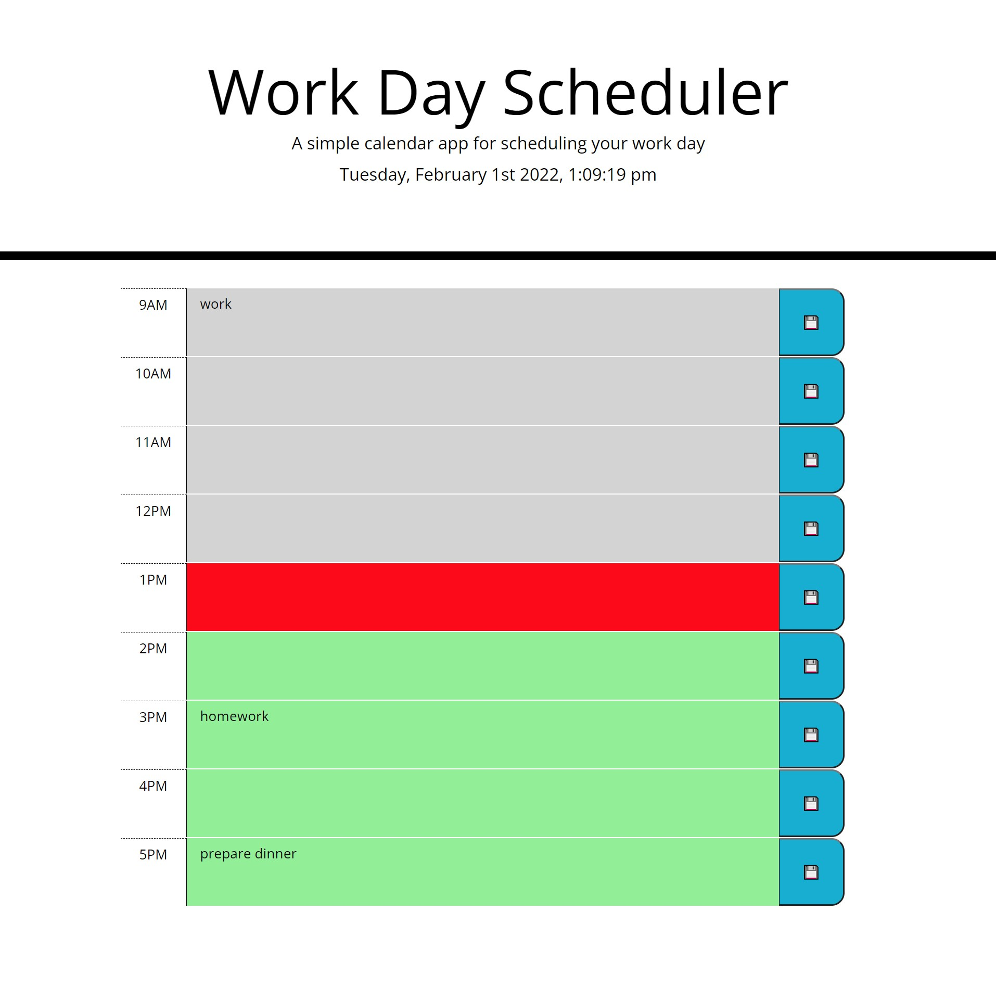

# Interactive Schedule
https://kashane1.github.io/interactive-scheduling/
-----------
Following the link above will bring you to the interactive schedule!

-----------
Process:
-----------
On day 1 I decided togive it 1 solid hour and get the skeleton of the code down. I'm actively practing to make comments and notes as I write my code now. 

Starting with pseudo code has proven to be helpful for me too. I knew I would need some time of ul li design for the timeblocks. I was able to use the given css file to help with labeling the correct classes. There was enough starter code to basically finish the ul li portion of the assignment. As for the javascript, I had to start from scratch. I also had to brush up on more jquery techniques and it really helped me finish the assignment as well as make it look cleaner. 

I found a good working solution for the color changing of the blocks as time passes. I did stumble a little with moment.js but soon found the best way to make the api work the way i needed it to.

On day 2 I gave it another good hour and was able to finish the assignment. Read over the code and started adding better comments and a detailed readme file.

On day 3 I gave multiple read throughs and tests and completed the readme file.


-----------
Requirements:
-----------
1. When the user opens the daily planner, the current date and time is displayed at the top
2. Below that, there are timeblocks with standard business hours, each color coded to represent past, present future.
3. The user can enter text in any time block and click the save button to store that information even after the page is refreshed.

-----------
```
preview of the interactive schedule:
```


-----------
Cited:
-----------
https://www.w3schools.com/ - for javascript references

https://developer.mozilla.org/en-US/ - for javascript references

https://api.jquery.com/ - for jquery references